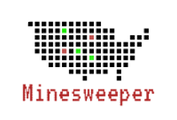

<div align="center">

[![Contributors][contributors-shield]][contributors-url]
[![Forks][forks-shield]][forks-url]
[![Stargazers][stars-shield]][stars-url]
[![Issues][issues-shield]][issues-url]
[![MIT License][license-shield]][license-url]

</div>

<!-- PROJECT LOGO -->
<br />
<h2>
<div align="center">
  <a href="https://github.com/manupranav/minesweeper">
    
  </a>
</h2>
<h2 align="center">Minesweeper</h2>

  <p align="center">
    This is a minesweeper game which is developed using Object Oriented Programming concepts. It use python's tkinter library.
    <br />
    <a href="https://github.com/manupranav/minesweeper"><strong>Explore the docs »</strong></a>
    <br />
    <br />
    <a href="https://github.com/manupranav/minesweeper">View Demo</a>
    ·
    <a href="https://github.com/manupranav/minesweeper/issues">Report Bug</a>
    ·
    <a href="https://github.com/manupranav/minesweeper/issues">Request Feature</a>
  </p>
</div>

<!-- TABLE OF CONTENTS -->
<details>
  <summary>Table of Contents</summary>
  <ol>
    <li>
      <a href="#overview">Overview</a>
      <ul>
        <li><a href="#built-with">Built With</a></li>
      </ul>
    </li>
    <li>
      <a href="#getting-started">Getting Started</a>
    </li>
  </ol>
</details>

<!-- Overview -->

## Overview

[![Minesweeper Preview][product-preview]](https://github.com/manupranav/minesweeper/blob/main/media/demo.gif)
[![Minesweeper Demo][product-video]](https://github.com/manupranav/minesweeper/blob/main/media/demo.gif)

## Built With

[![Python][python.org]][python-url]

<!-- GETTING STARTED -->

## Getting Started

```bash
# Clone this repository
$ git clone https://github.com/manupranav/minesweeper.git

# Go into the repository
$ cd minesweeper

# Run the app
$ python main.py
```

<!-- MARKDOWN LINKS & IMAGES -->
<!-- https://www.markdownguide.org/basic-syntax/#reference-style-links -->

[contributors-shield]: https://img.shields.io/github/contributors/manupranav/minesweeper.svg?style=for-the-badge
[contributors-url]: https://github.com/manupranav/minesweeper/graphs/contributors
[forks-shield]: https://img.shields.io/github/forks/manupranav/minesweeper.svg?style=for-the-badge
[forks-url]: https://github.com/manupranav/minesweeper/network/members
[stars-shield]: https://img.shields.io/github/stars/manupranav/minesweeper.svg?style=for-the-badge
[stars-url]: https://github.com/manupranav/minesweeper/stargazers
[issues-shield]: https://img.shields.io/github/issues/manupranav/minesweeper.svg?style=for-the-badge
[issues-url]: https://github.com/manupranav/minesweeper/issues
[license-shield]: https://img.shields.io/github/license/manupranav/minesweeper.svg?style=for-the-badge
[license-url]: https://github.com/manupranav/minesweeper/blob/master/LICENSE.txt
[linkedin-shield]: https://img.shields.io/badge/-LinkedIn-black.svg?style=for-the-badge&logo=linkedin&colorB=555
[linkedin-url]: https://linkedin.com/in/linkedin_username
[product-screenshot]: images/screenshot.png
[next.js]: https://img.shields.io/badge/next.js-000000?style=for-the-badge&logo=nextdotjs&logoColor=white
[next-url]: https://nextjs.org/
[react.js]: https://img.shields.io/badge/React-20232A?style=for-the-badge&logo=react&logoColor=61DAFB
[react-url]: https://reactjs.org/
[vue.js]: https://img.shields.io/badge/Vue.js-35495E?style=for-the-badge&logo=vuedotjs&logoColor=4FC08D
[vue-url]: https://vuejs.org/
[angular.io]: https://img.shields.io/badge/Angular-DD0031?style=for-the-badge&logo=angular&logoColor=white
[angular-url]: https://angular.io/
[svelte.dev]: https://img.shields.io/badge/Svelte-4A4A55?style=for-the-badge&logo=svelte&logoColor=FF3E00
[svelte-url]: https://svelte.dev/
[laravel.com]: https://img.shields.io/badge/Laravel-FF2D20?style=for-the-badge&logo=laravel&logoColor=white
[laravel-url]: https://laravel.com
[bootstrap.com]: https://img.shields.io/badge/Bootstrap-563D7C?style=for-the-badge&logo=bootstrap&logoColor=white
[bootstrap-url]: https://getbootstrap.com
[jquery.com]: https://img.shields.io/badge/jQuery-0769AD?style=for-the-badge&logo=jquery&logoColor=white
[jquery-url]: https://jquery.com
[python.org]: https://img.shields.io/badge/Python-14354C?style=for-the-badge&logo=python&logoColor=white
[python-url]: https://www.python.org/
[product-preview]: media/preview.png
[product-video]: media/demo.gif
